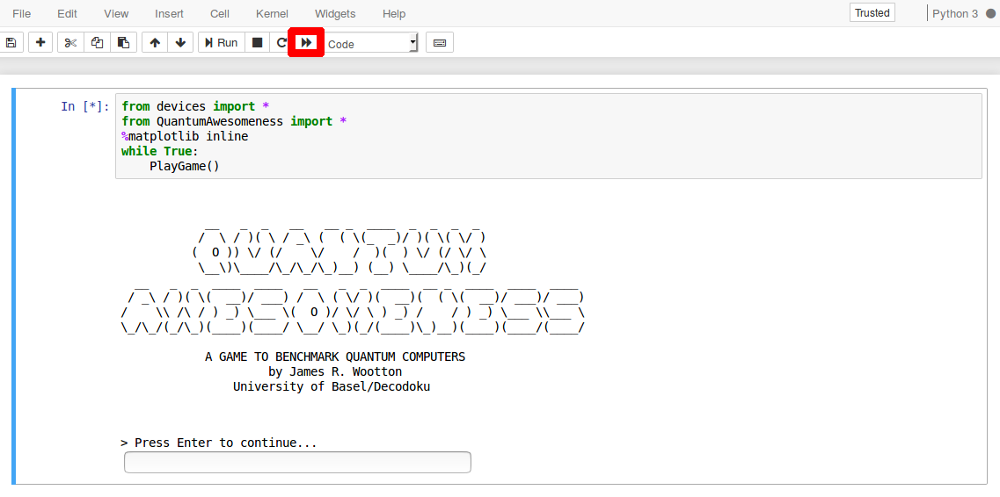

# Quantum Awesomeness
## A Game to Benchmark Quantum Computers

### Intro

This game is designed to run on any and all prototype devices capable of universal quantum computation. The better the device, the better the game will run. This therefore allows a simple and accessible way to assess and compare these prototypes.

The game consists of a series of rounds. Each has a puzzle like the one above, and each is a bit harder than the last.

Puzzles from higher rounds require higher depth circuits, and so build-up of noise contributes to an increase in difficulty. The number of rounds that the game remains playable for therefore depends on the noise levels of the device. Also, the complexity of the puzzles depends on the size and connectivity of the device that runs them. These properties mean that the game gives the player direct experience of the most important factors affecting the current generation of prototype quantum computers.

For more on the gritty details, see
* [Benchmarking of quantum processors with random circuits (paper)](https://arxiv.org/abs/1806.02736)
* [Using a simple puzzle game to benchmark quantum computers (blog post)](https://medium.com/@decodoku/understanding-quantum-computers-through-a-simple-puzzle-game-a290dde89fb2)
* [Kicking the tires of quantum processors (blog post)](https://hackernoon.com/kicking-the-tires-of-quantum-processors-2b18750916dd)

### How to play

The easiest way to play is to use the browser version [here](https://mybinder.org/v2/gh/decodoku/A_Game_to_Benchmark_Quantum_Computers/master?filepath=Play_Quantum_Awesomeness.ipynb) (though it might take a few attempts before it actually loads). Just press the run button, as highlighted in red in the image below.

This version either simulates a game on the chosen device, or creates one using data that has already been extracted from the real quantum computer.

### Contributing data

If you have a quantum device you want to run the game on, check out [devices.py](devices.py). Here you can add the details of your setup. You can choose to use either QISKit or ProjectQ as the SDK, but you'll have to get the SDK to talk to your device yourself. As a first step, you can set the SDK to be "ManualQISKit". This will print a QASM to screen when it wants to run a quantum job, and ask for the results to be pasted in.

Once you've generated data, it would be great if you added it to this repository. Then all could see how great your device is.
